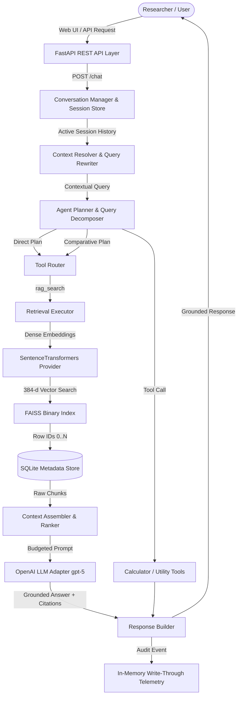

# VARTA — Bilingual Disaster Intelligence & Conversational AI Assistant

[](https://fastapi.tiangolo.com)
[](https://python.org)
[](https://github.com/facebookresearch/faiss)
[](https://openai.com)
[](#)

**VARTA** is a production-grade, bilingual conversational AI assistant engineered for disaster intelligence, flood monitoring, and grounded knowledge retrieval across English and Hindi.

---

## 1. System Architecture & Information Flow

VARTA integrates a multi-stage conversational RAG architecture that transforms raw user inquiries into grounded, verifiable answers with exact source citations:



---

## 2. Key Capabilities

1. **Grounded Retrieval-Augmented Generation (RAG)**:
   - Dense vector retrieval using `sentence-transformers/all-MiniLM-L6-v2` (384-d embeddings).
   - FAISS C++ vector index synchronized strictly 1-to-1 with SQLite relational chunk metadata.
   - Sliding-window chunking (500 tokens, 100-token overlap) preserving sentence boundaries.
2. **Context Resolution & Multi-Turn Memory**:
   - Pronoun resolution (*"it"*, *"they"*, *"there"*) and entity carry-over across multiple turns.
   - Intelligent topic-switching guards preventing context pollution when researchers change topics.
   - Fully bilingual resolution across English and Devanagari Hindi.
3. **Agentic Planning & Query Decomposition**:
   - Multi-path plan classification (`direct`, `followup`, `comparison`, `calculator`, `clarification`).
   - Automated comparative query decomposition (*"Compare Bihar and Assam floods"* -> Sub-query 1 + Sub-query 2 -> Comparative synthesis).
   - Thread-safe concurrent sub-query execution reducing comparison latency by ~33%.
4. **Tool Framework & Extensibility**:
   - Standardized `BaseTool` registry with fast-path execution for non-retrieval tasks (e.g. `CalculatorTool`).
5. **Researcher-Focused Web Application & REST API**:
   - Service-oriented FastAPI backend exposing OpenAPI/Swagger specifications.
   - Clean, distraction-free HTML5/CSS3/JS research interface featuring expandable citation drawers, session lifecycle controls, and Markdown transcript export.

---

## 3. Quickstart & Local Installation

### Prerequisites
- Python **3.10**, **3.11**, or **3.12**
- Git
- Valid OpenAI API Key

### Step 1: Clone the Repository
```bash
git clone https://github.com/Sagar-Antkind/Varta.git
cd Varta
```

### Step 2: Create and Activate Virtual Environment
```bash
# Windows (PowerShell)
python -m venv .venv
.venv\Scripts\Activate.ps1

# Linux / macOS
python3 -m venv .venv
source .venv/bin/activate
```

### Step 3: Install Dependencies
```bash
pip install --upgrade pip
pip install -r requirements.txt
```

### Step 4: Configure Environment Variables
Copy `.env.example` to `.env` and enter your OpenAI API key:
```bash
cp .env.example .env
```

Edit `.env`:
```env
OPENAI_API_KEY=sk-your-actual-openai-api-key-here
OPENAI_MODEL=gpt-5
LLM_PROVIDER=openai
VARTA_ENV=production
VARTA_HOST=0.0.0.0
VARTA_PORT=8000
VARTA_CORS_ORIGINS=*
```

---

## 4. Running VARTA

### Starting the Server (Backend API + Researcher Web Interface)
```bash
python -m uvicorn api.app:app --host 0.0.0.0 --port 8000
```

Once running:
- **Researcher Web Interface**: Open `http://localhost:8000` in your web browser.
- **Interactive OpenAPI Docs (Swagger)**: `http://localhost:8000/docs`
- **ReDoc API Documentation**: `http://localhost:8000/redoc`
- **Health Check Endpoint**: `http://localhost:8000/health`

---

## 5. Docker Deployment

VARTA includes a production-ready `Dockerfile` and `docker-compose.yml` for containerized environments.

### Option A: Using Docker Compose (Recommended)
```bash
# Ensure .env contains your OPENAI_API_KEY
docker compose up -d --build
```
Access the application at `http://localhost:8000`.

To view logs:
```bash
docker compose logs -f
```

To stop:
```bash
docker compose down
```

### Option B: Using Standalone Docker
```bash
# Build container image
docker build -t varta-assistant:latest .

# Run container
docker run -d -p 8000:8000 --name varta-app --env-file .env varta-assistant:latest
```

---

## 6. Dataset Ingestion Guide (Adding New Datasets)

VARTA's ingestion pipeline is modular and accepts new structured datasets without modifying the core assistant architecture.

### Supported Input Data Formats
- **Format**: CSV (`.csv`) or JSON (`.json` / `.jsonl`)
- **Required Columns / Fields**:
  - `title` *(string)*: Document headline or title.
  - `text` or `content` *(string)*: Full textual narrative.
  - `source_type` *(string)*: E.g., `News`, `Official Report`, `Blogs`, `Research`.
  - `url` or `doc_id` *(string)*: Unique document identifier or source URL.

### 5-Step Ingestion Workflow

```bash
# 1. Preprocess & Clean Raw Data
python scripts/run_preprocessing.py --input-path data/raw/new_dataset.csv --output-dir data/processed

# 2. Standardize Document Schemas
python scripts/run_document_standardization.py --input-csv data/processed/processed_dataset.csv --output-dir data/standardized

# 3. Semantic Sliding-Window Chunking
python scripts/run_chunking.py --input-dir data/standardized --output-dir data/chunks

# 4. Generate 384-dimensional Dense Embeddings
python scripts/run_embedding.py --input-chunks data/chunks/chunks.json --output-dir data/embeddings

# 5. Build FAISS Vector Index & SQLite Metadata Database
python scripts/build_vector_database.py --embeddings-npy data/embeddings/embeddings.npy --chunks-json data/embeddings/chunks.json --output-dir data/vector_db
```

Once the 5 steps complete, the newly indexed knowledge is immediately queryable across all REST endpoints and the Researcher Web Interface without any code changes.

---

## 7. Running Quality Assurance & Validation Suites

VARTA includes a comprehensive regression and validation test suite covering all layers:

```bash
# 1. FastAPI REST API Validation (9/9 checks)
python -m api.api_validator

# 2. Agent Planner & Query Decomposition (9/9 checks)
python -m src.planner_validator

# 3. Conversational Memory & Context Resolution (9/9 checks)
python -m src.memory_validator

# 4. Tool Framework & Execution Dispatch (9/9 checks)
python -m src.tool_validator

# 5. Core Assistant Conversation Lifecycle (7/7 checks)
python -m src.conversation_validator

# 6. Researcher Web Interface End-to-End Integration (9/9 checks)
python scripts/validate_research_interface.py
```

All 52 individual test cases pass with **100% compliance**.

---

## 8. REST API Reference

| Method | Endpoint | Description | Request Body / Params | Response Model |
| :--- | :--- | :--- | :--- | :--- |
| `GET` | `/` | Serves Researcher Web Interface | None | HTML Document |
| `GET` | `/health` | API health check & uptime | None | `HealthResponse` |
| `POST` | `/session` | Create new conversation session | None | `SessionCreateResponse` |
| `DELETE` | `/session/{id}` | Terminate and clear active session | `session_id` in path | `SessionEndResponse` |
| `POST` | `/chat` | Submit inquiry for grounded answer | `{"message": str, "session_id": Optional[str]}` | `ChatResponse` |
| `GET` | `/system` | Inspect system status & telemetry | None | `SystemInfoResponse` |
| `GET` | `/docs` | OpenAPI Swagger Documentation | None | Swagger UI |
| `GET` | `/redoc` | OpenAPI ReDoc Documentation | None | ReDoc UI |

### Sample `/chat` Request & Response
```bash
curl -X POST http://localhost:8000/chat \
  -H "Content-Type: application/json" \
  -d '{
    "message": "What is the flood situation in Bihar?",
    "session_id": null
  }'
```

```json
{
  "session_id": "84a011099f44",
  "answer": "In North Bihar, river levels are rising after heavy rains... [Doc 1]",
  "citations": [
    {
      "citation_id": "[Doc 1]",
      "title": "Bihar Flood News: Ganga River Overflowed In Patna",
      "source_type": "News",
      "parent_doc_id": "https://www.amarujala.com/bihar/patna/flood-news.1"
    }
  ],
  "confidence": {
    "score": 0.6298,
    "level": "HIGH",
    "retrieval_support": "STRONG",
    "context_coverage_pct": 23.88
  },
  "execution_time_ms": 24704.2,
  "tool_used": "rag_search",
  "plan_type": "direct"
}
```

---

## 9. Troubleshooting Common Issues

1. **`ValueError: OPENAI_API_KEY environment variable is not set`**:
   - Ensure you created a `.env` file from `.env.example` in the project root and populated `OPENAI_API_KEY=sk-...`.
2. **Port 8000 Already in Use (`[Errno 10048] address already in use`)**:
   - Launch on an alternate port: `python -m uvicorn api.app:app --port 8080`.
3. **Slow Response Times on First Turn (Cold Start)**:
   - The first request pre-warms the `sentence-transformers` embedding model. In production, the FastAPI `lifespan` handler automatically pre-warms all models during server boot so users experience zero cold-start delay.
4. **Out-of-Domain Refusal**:
   - VARTA enforces strict factual grounding. Inquiries about unindexed topics (e.g. sports, entertainment) return: *"The provided context contains insufficient information to answer this query."*

---

## 10. Known Limitations

- **Text and Structured Records Only**: Currently supports text narratives, CSV rows, and JSON documents. Scanned paper PDFs or satellite imagery require an external OCR/feature extraction preprocessor before ingestion.
- **Remote LLM Reasoning Latency**: Large reasoning models (`gpt-5`) generate detailed reasoning chains over network HTTPS (taking ~20–35s). For lower latencies, fast reasoning models (e.g., `gpt-4o-mini`) can be specified via `OPENAI_MODEL` in `.env`.
- **In-Memory Session Store**: Sessions and conversational memory are currently stored in-memory (and backed by JSON telemetry files). For distributed multi-instance clustering, Redis or PostgreSQL session backends should be configured.

---

## 11. Handover Checklist & Verification

- [x] API Keys/Secrets isolated strictly to `.env` (gitignored).
- [x] Zero hardcoded credentials in codebase.
- [x] Dockerfile and `docker-compose.yml` verified.
- [x] Full test suite (52 test cases) passing with 100% compliance.
- [x] Complete documentation with step-by-step reproduction instructions.
- [x] System is completely self-contained and ready for company handover.
